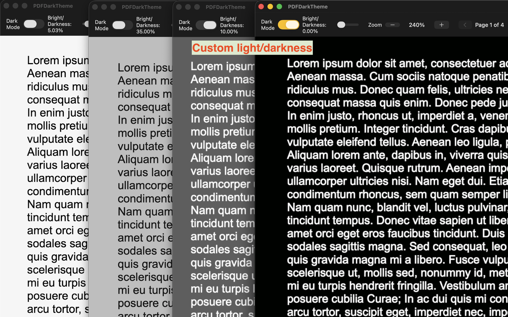
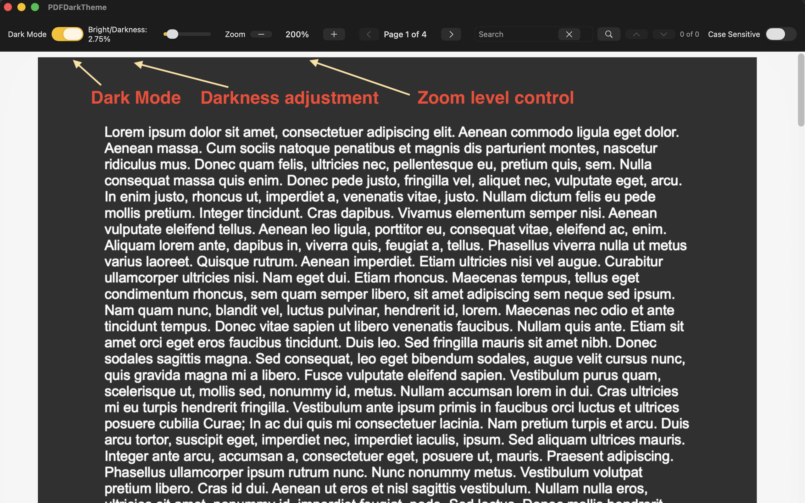

PDFDarkTheme is a macOS-native PDF reader app. It provides true dark mode with intelligent color inversion that preserves text sharpness at any zoom level.  

The app link: https://apps.apple.com/us/app/pdfdarktheme/id6759441175

**Control light/darkness**

**It has Light/Dark mode toggle, zoom level control, page navigation and text search** 

If you have anything question or problem about PDFDarkTheme app, please contact me at [mambo237@yahoo.com](mailto:mambo237@yahoo.com). Please provide me the following info: 

(1) Put the name of the app in the email title like "PDFDarkTheme support" or "PDFDarkTheme question". 

(2) The detail description of the problem or question.  

I will contact you as soon as possible.
